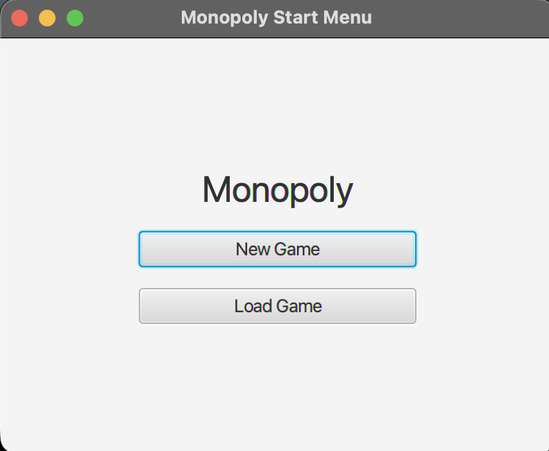
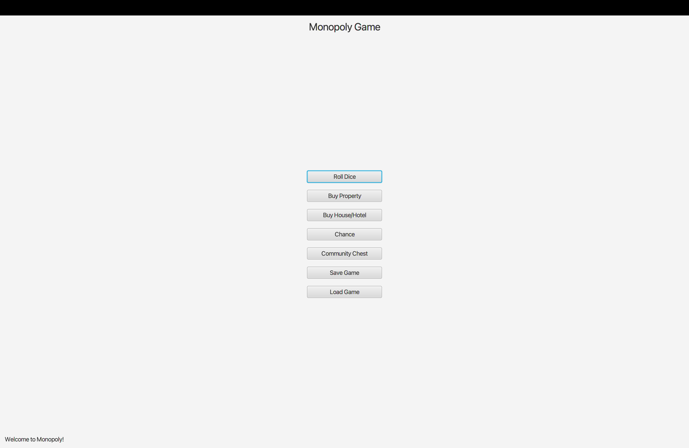

### Monopoly Game (JavaFX GUI Version): 

I created this Monopoly-style game using JavaFX by turning the main mechanics of the board game into an interactive graphical program. In this version, the player can roll dice, buy properties, build houses or hotels, and draw Chance or Community Chest cards directly through the interface. The game updates the player’s position, balance, and status as they move around the board, and it also includes the ability to save progress to a text file and load it later. The goal was to take the earlier text-based version I built and bring it to life with a simple and functional GUI.

---

### Features: 
- Built using JavaFX to provide a functional GUI.
- Includes a start screen that appears a few seconds after launch, allowing players to choose New Game or Load Game.
- Interactive buttons for:
  - Rolling dice
  - Buying properties
  - Building houses and hotels
  - Drawing Chance and Community Chest cards
- Displays real-time updates such as the player’s position, balance, and status messages.
- Save and load functionality using save.txt, allowing players to resume their game later.
- Project was initially structured by referencing my professor’s JavaFX example project, "javafxhelloworld-copyme."

### How to Run the Project: 
- Open the project in IntelliJ IDEA.
- Navigate to the project’s source files and run "MonopolyApp.java."
- After a few seconds, the JavaFX window will launch and display the start screen.
- Choose New Game or Load Game to continue.
- Use the on-screen buttons to roll dice, buy properties, or choose other available actions.
- When you’re finished playing, click Save Game to write your progress to save.txt, which you can load again later.

---

## Screenshots:

*(The 2 pictures above are the screenshots of my game Monopoly GUI version running in JavaFX.)*

---

### Notes:

Working on this project helped me understand JavaFX much better and gave me a chance to take a simple idea and turn it into a full interactive program. I learned how to connect the interface to the controller classes, how to update the screen based on player actions, and how to organize a project that has multiple moving parts. It was also my first time building a save and load system inside a GUI application, so figuring out how to store and reload the game state taught me a lot about planning the flow of a program. Overall, this project showed me how a basic game idea can grow into something more complete when the design and structure come together.

---

