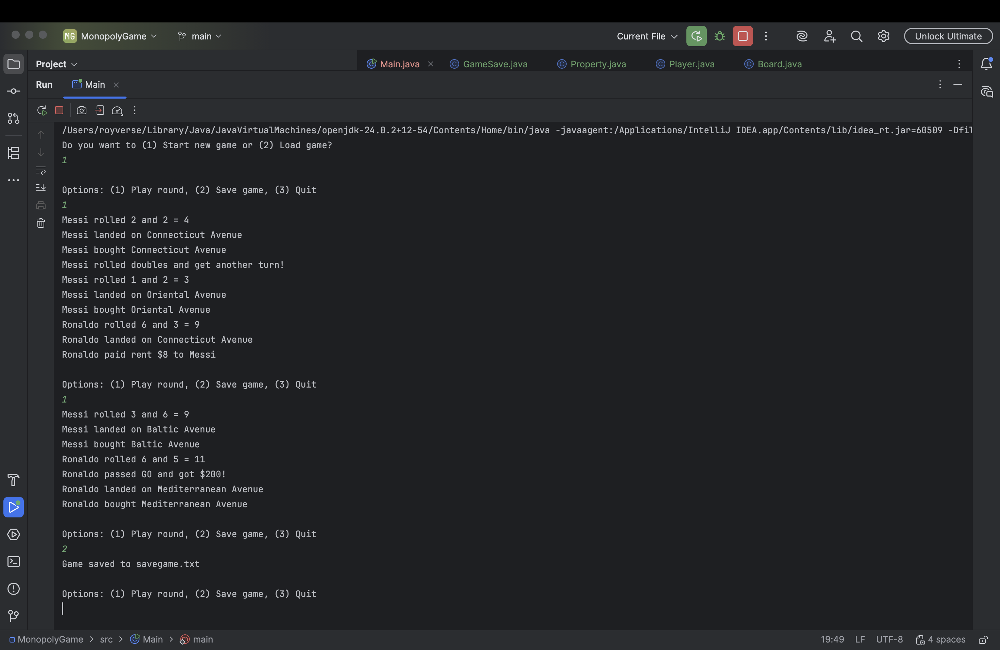

# Basic Monopoly Game (Java)

- This is my second project from my CIS 296-Java class, where I created a simple version of Monopoly Game.  
- In this game: players can roll dice, move around the board, buy properties, pay rent, pass GO, and go to jail.  
- The game also has save and load features using a text file as well.

---

## Program Output Screenshot:

*(This is the screenshot of my program's running output from my monopoly game!)*

---

## Self-Assessment:
- **I was able to complete the project with all the required parts mentioned from my professor:**
---
- **Classes for gameplay**: Including: Player, Property, Board.
- **Game play itself**: Players moving around the board such as: buying property, paying rent, passing GO, going to jail, and handling bankrupt players.
- **Game save and load**: Game state is written to and read from a text file.

---

## My Personal Feedback:
- Overall, I am confident that my project demonstrates my ability to work with Java classes, loops, conditions, and file handling to build a functional program. I think generally it was a good challenge, and I learned a lot while completing it. However, there were a few things that I had to look up online to understand the concept. But at the end, I felt like everything made sense to me after watching some tutorial videos on YouTube about the information I gathered from online sources.
